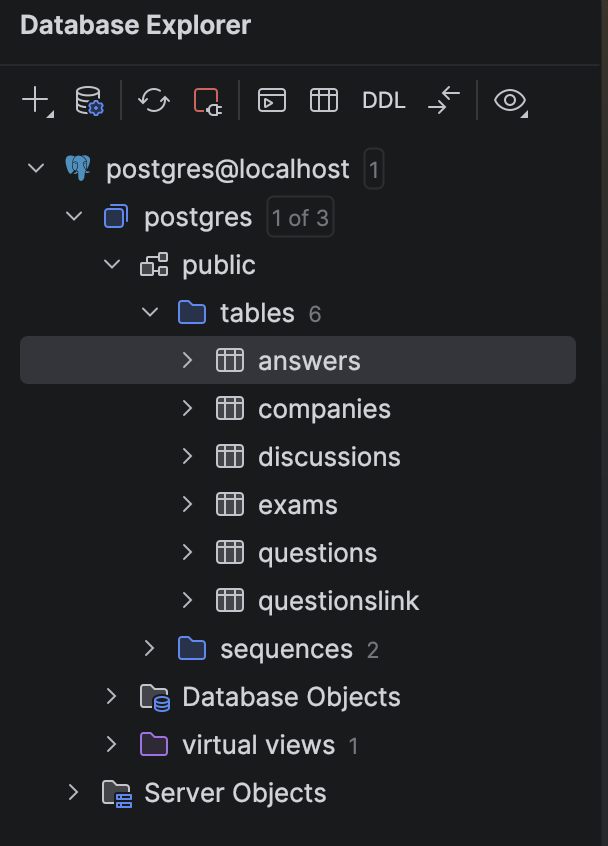
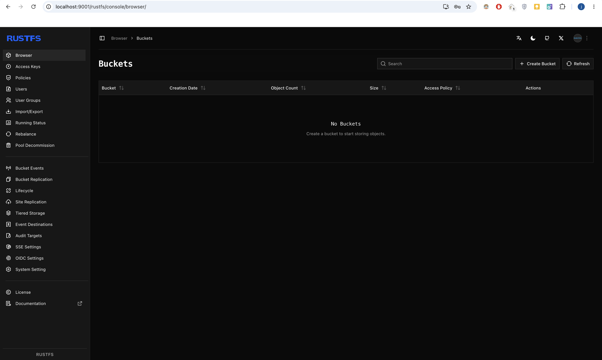
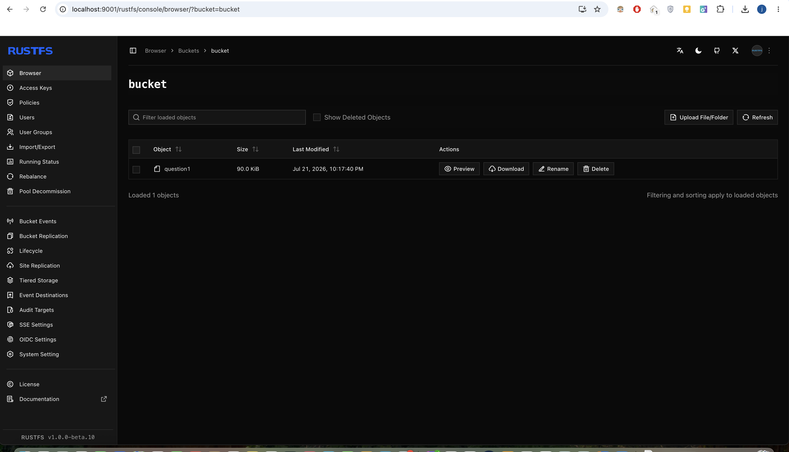
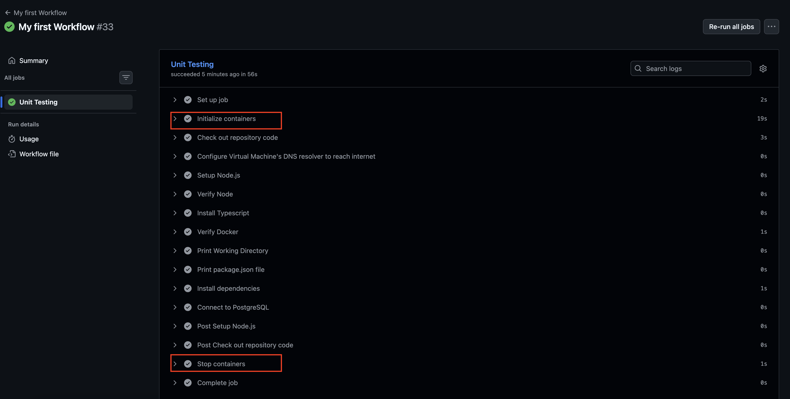
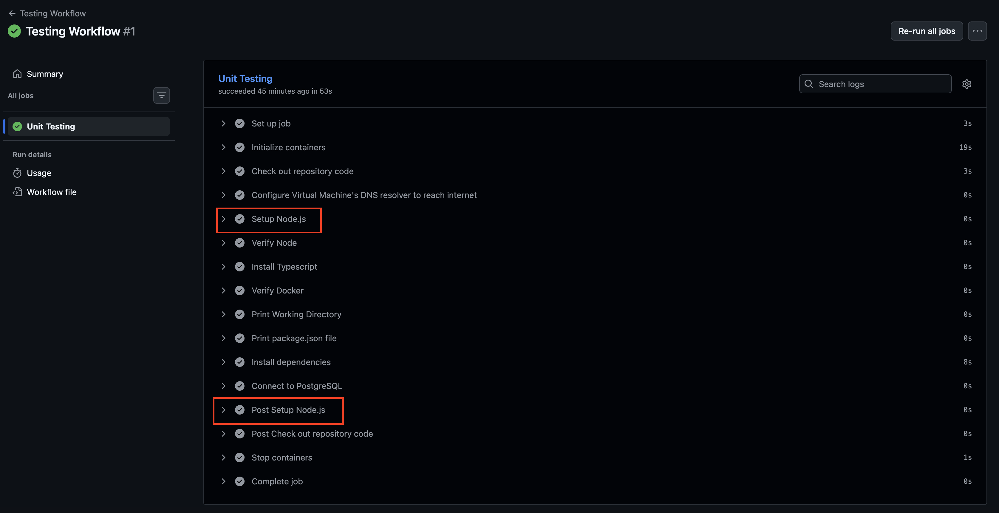
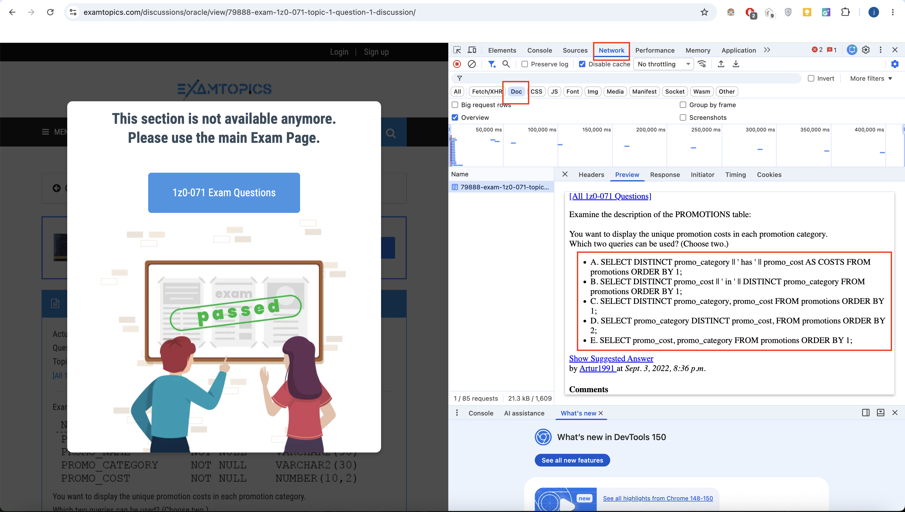

# EXAMTOPICSCRAPER
The reason I was doing this is because I don't want to pay the expensive fee to see the certification dumps lol. 

# Project Highlights
[Postgres container working](./screenshots/datagripConnectPostgres.png)



[Storage bucket working](./screenshots/storagebucket.png)



[Upload object to Storage Bucket](./screenshots/createdBucketAndUploadedObject.png)



[Docker containers in workflow created & removed](./screenshots/serviceContainerInWorkflow.png)



[Node & NPM in workflow created & removed](./screenshots/node&npmInWorkflow.png)



[Scape raw document from website using inspect network and code](./screenshots/inspectNetworkAsset.png)



# Pipeline commands
1) npm run unitTest -- build/test/extractAllRawDocument.test.js
2) java -jar /Users/jonathankee/examTopicScraper/static_page/build/libs/static_page-1.0-SNAPSHOT-all.jar
3) Run markdown code

# Browser Pipeline commands
- tsc --build --clean 
- tsc --build  
1) tsc && node ./build/commands/scrapeWebsiteLinksIntoPostgres.js
2) tsc && node ./build/commands/scrapeWebsiteLinksIntoPostgresHardcode.js
3) tsc && node ./build/commands/scrapeDataIntoPostgres.js
4) tsc && node ./build/commands/scrapeImages.js
5) tsc && node ./build/commands/markdown.js

# Postgres docker installation
Youtube link:
- https://www.youtube.com/watch?v=Hs9Fh1fr5s8&t=228s

Start a postgres container:
- docker run --name postgres-container \
  -e POSTGRES_PASSWORD=abc123 \
  -v "$(pwd)/docker_volume:/var/lib/postgresql" \
  -p 5432:5432 \
  -d postgres:latest

Check container processes:
- docker ps -a 

Run psql inside postgres container:
- docker exec -it postgres-container psql -U postgres 

Feed sql file to postgres container:
- docker exec -i postgres-container psql -U postgres -d postgres < ./sql/docker_pg_scraper.sql
- docker exec -i postgres-container psql -U postgres -d postgres < ./sql/docker_pg_seq_scraper.sql
- docker exec -i postgres-container psql -U postgres -d postgres < ./sql/docker_pg_schema.sql
- docker exec -i postgres-container psql -U postgres -d postgres < ./sql/docker_pg_seq_schema.sql

Use datagrip and connect and see if the SQL files are ran

Data still persist after start & stop:
- docker stop postgres-container
- docker start postgres-container

# Backup Postgres docker data (Incase I lose all data at some point)
docker exec -t postgres-container pg_dump -U postgres -d postgres > ./backup_sql/backup.sql

# RustFS (Minio Replacement) docker installation
(Skip, Managed my Docker-managed named volumes) Create data and logs directories:
- mkdir -p data logs

(Skip, Managed my Docker-managed named volumes) Change the owner of these directories:
- sudo chown -R 10001:10001 data logs

Using latest version (Using Docker-managed named volumes) (Gemini fix):
- docker run --detach \
        --name=rustfs \
        --publish 9000:9000/udp \
        --publish 9000:9000/tcp \
        --publish 9001:9001/udp \
        --publish 9001:9001/tcp \
        --volume rustfs-data:/data \
        --volume rustfs-logs:/logs \
        -e RUSTFS_ACCESS_KEY="rustfsadmin" \
        -e RUSTFS_SECRET_KEY="rustfsadmin" \
        -e RUSTFS_ADDRESS="0.0.0.0:9000" \
        -e RUSTFS_CONSOLE_ADDRESS="0.0.0.0:9001" \
        -e RUSTFS_CONSOLE_ENABLE=true \
        -e RUSTFS_CORS_ALLOWED_ORIGINS="*" \
        -e RUSTFS_CONSOLE_CORS_ALLOWED_ORIGINS="*" \
        rustfs/rustfs:latest \
        --access-key "rustfsadmin" \
        --secret-key "rustfsadmin" \
        --console-enable \
        /data

# Installation Guide
Follow the official github documentation:
- https://docs.github.com/en/actions/how-tos/manage-runners/self-hosted-runners/add-runners#adding-a-self-hosted-runner-to-a-repository

Follow below for personalized installation:
- https://github.com/jonathan-kee/examTopicScraper/settings/actions/runners/new?arch=arm64&os=linux

# Vagrant After Setup & Provisioning 
1) cd linux/selfhost-runner
2) vagrant up --provider vmware_desktop
3) vagrant ssh Server1
4) cd actions-runner
5) ./run.sh

# Run Github Actions
Link to Github Actions workflow:
- https://github.com/jonathan-kee/examTopicScraper/actions/workflows/first-example.yml

- Click Run Workflow

# Vagrant Setup & Provisioning
You need to enable the setting below for vmware to work:
Privacy & Security -> Full Disk Access -> vagrant-vmware-utility

1) cd linux/selfhost-runner
2) vagrant up --provider vmware_desktop
3) vagrant provision (You can skip this step, vagrant up will already provision)
4) vagrant ssh Server1
5) sudo chown -R vagrant:vagrant /home/vagrant/actions-runner
6) cd actions-runner
7) ./config.sh --url https://github.com/<OWNER>/<REPO> --token YOUR_TOKEN_HERE

*** Enter registration process details ***

./run.sh

# My registration process
Runner Registration
Enter the name of the runner group to add this runner to: [press Enter for Default] 

Enter the name of runner: [press Enter for Server1] prod-rocky-runner

This runner will have the following labels: 'self-hosted', 'Linux', 'ARM64' 
Enter any additional labels (ex. label-1,label-2): [press Enter to skip] 

√ Runner successfully added

Runner settings

Enter name of work folder: [press Enter for _work] 

√ Settings Saved.

# Resources to learn webscraping
1) Website on webscraping & crawling:
- https://webscraping.fyi/

2) I am currently using browser automation instead of http clients:
- https://webscraping.fyi/overview/browser-automation/
- https://webscraping.fyi/overview/languages/#http-clients

3) Youtube channels on webscraping & crawling:
- https://www.youtube.com/@MichaelMintz
- https://www.youtube.com/@JohnWatsonRooney/playlists

4) Airflow being used for webscraping:
- https://www.youtube.com/watch?v=CraPKax37lo

# Resources to learn Data Engineering
1) Official Reddit Date Engineering website
- https://dataengineering.wiki/Tools/Tools

2) Kodekloud
- https://kodekloud.com/courses/data-engineering-fundamentals

3) Architecture for Data
- https://www.youtube.com/watch?v=gsUqW1IookY

4) Workflow Orchestration

Airflow certification link:
- https://academy.astronomer.io/page/astronomer-certification

Notes on Airflow certification:
- https://substack.com/@michaelsalata/p-181463528

5) Data Ingestion

Dlt Certification links:
- https://dlthub.learnworlds.com/course/dlt-fundamentals
- https://dlthub.learnworlds.com/course/dlt-advanced

6) Data Processing

DBT Certification links:
- https://learn.getdbt.com/learning-paths/dbt-certified-developer
- https://learn.getdbt.com/learning-paths/dbt-certified-cloud-architect

Apache Spark (Data bricks certs)

7) Data Analytics
- Excel
- Power BI

# 12 Factor App Methodology
Github Actions solves 
- Codebase
- Build, Release and Run

^
You have to learn Git before Github Actions to make sense, can try below:
- https://blinry.itch.io/oh-my-git

# Project Management Tools
Github's Project Management tool like Trello, Jira:
- https://github.com/jonathan-kee/examTopicScraper/projects?query=is%3Aopen

Very useful feature for Github:
- https://docs.github.com/en/issues/tracking-your-work-with-issues/using-issues/linking-a-pull-request-to-an-issue

Scrum with GitHub Projects (Very good introduction to Github Projects):
- https://www.youtube.com/watch?v=06AWiNvjlQU&list=PLGxFXI4dC2siB2ENZ6OhagfwSId5FcWmY

Github Workflow for Issues and Pull Requests:
- https://www.youtube.com/watch?v=d3N2yeAaLkc

^
1) Create Issues 
2) Issue can become a branch or link a pull request to the Issue
3) Issue become a new branch, compare branch to main and create a pull request
4) Creating a pull request will link to the issue
5) Merge Pull request will also close the issue

TLDR: Create Issue -> New Branch from Issue -> Create Pull Request (Compare branch to main) -> Merge Pull Request -> Close Issue

GitHub Foundations Certification Course (Most detailed explanation on Issues & Pull Request):
- https://www.youtube.com/watch?v=Jdc0i7RcBv8

Learn about Github Issue before moving into Github projects:
- https://docs.github.com/en/issues/tracking-your-work-with-issues/learning-about-issues/quickstart

Github projects training course:
- https://learn.microsoft.com/en-us/training/modules/manage-work-github-projects/

Question: So how does Github Issues, Github Projects fit into CI / CD?

*** Project Idea, have text to speech for recordings / meetings, then translate it Github Projects UI ***

# System Packages / Project Setup
1) Install node version manager:
- curl -o- https://raw.githubusercontent.com/nvm-sh/nvm/v0.39.7/install.sh | bash

^^^^^^
The following wont work if ~/.profile exist, Then you need to manually add to .bashrc by doing the following:
- echo 'export NVM_DIR="$HOME/.nvm"
[ -s "$NVM_DIR/nvm.sh" ] && \. "$NVM_DIR/nvm.sh"  # This loads nvm
[ -s "$NVM_DIR/bash_completion" ] && \. "$NVM_DIR/bash_completion"  # This loads nvm bash_completion' >> ~/.bashrc

2) Make .bashrc take effect immediately by sourcing:
- source ~/.bashrc

3) Install Node 24:
- nvm install 24

4) Verify the Node.js version:
- node -v

5) Verify npm version:
- npm -v

6) Install Typescript:
- npm install -g typescript

7) Install Dependencies:
- npm install

8) Compile Typescript and launch with node with sample arguments:
- tsc && node ./build/index.js

# Npm Commands that are relevent
1) After npm install, there might be vulnerabilities:
- npm audit fix

# Run all tests
Compile Typescript to build folder, run all tests
- tsc --build --clean 
- tsc --build  
- npm run test

# Run specific test
Compile Typescript to build folder, run specific test
- tsc --build --clean 
- tsc --build  
- npm run unitTest -- build/test/add.test.js
- npm run unitTest -- build/test/env.test.js
- npm run unitTest -- build/test/extractRawDocument.test.js
- npm run unitTest -- build/test/storageBucket.test.js
- npm run unitTest -- build/test/extractAllRawDocument.test.js

# Github Actions / Forejo Actions Setup

# Docker Setup
- Minio
- Postgres

^
Both of these need to use volume, otherwise they would data would be lost

I am not entirely sure if I should create an image for the webscraper

^
If I am not mistaken, the 12 factor app mentioned about containerize scripts

^
The famous voting app has a image that is not a web server, it's like a script that has loop forevor until it errors

Docker is actually a server, it comes with 
- Docker Daemon (dockerd)
- REST API
- Docker CLI (docker)

^
Based on Kodekloud's Docker-Certified-Associate-Exam-Course, You still need indepth knowledge of Linux

Link to Docker Certified Associate (DCA) Exam:
- https://a.storyblok.com/f/146871/x/2001ce939c/docker-study-guide_v1-5-jan-2025.pdf

Mirantis bought over the Docker Certification Exam:
- https://training.mirantis.com/certification/dca-certification-exam/

An alternative to Kodekloud's docker courses
https://labs.iximiuz.com/roadmaps/docker

Not sure what is the importance for the process tree looking like that
https://labs.iximiuz.com/challenges/docker-101-container-run-in-background

Download an image without starting a container:
1) docker image pull minio/minio

2) docker image pull postgres:14.21-trixie

3) Build Image for the webscraper

4) Create docker compose file

## Docker Setup QNA
Question: If Postgres has delta table extension, 
will it be able to handle DBA SQL as well?
Answer: 
- Oracle Database 12c DBA Handbook book is around 700 pages,
I will just assume Postgres DBA SQL is that deep as well.

- I have a folder named DBA1-handouts-16-en for Postgres DBA SQL, 
I downloaded from https://edu.postgrespro.com/16/DBA1-handouts-16-en.zip

# DBT Setup 
1) Install DBT fusion:
- https://docs.getdbt.com/docs/fusion/install-fusion-cli

2) Install DBT extension by "dbt Labs Inc":
- https://docs.getdbt.com/docs/install-dbt-extension

# Features to add
- Rescrape pages that result in dirty data, need to update / merge existing data.

^
Partially added for Answers, never needed for question & discussions

- Error handling for missing src images

- Workflow Orchestration with Airflow

- Column lineage with dbt

- Schema Drift from upstream (The HTML, Javascript from examtopics)

- SQL backup dump on repository, so when switch computer we get the data back

- Maybe instead of scraping the data directly, you take all the data first and dump it into a data lake,
then only process it at some future point

^
Try to use MINIO as a datalake, Hadoop also works

^
This pattern is good, because you don't have to think about transforming the data, you just focus on extracting as much data as possible

^
Good oppurtunity to use pg_lake for Postgres:
- https://github.com/Snowflake-Labs/pg_lake

- Convert the project into a CLI

- Add Presentation like Excel or PowerBi if possible

Use Playwright for more scalable web scraping:
- https://www.youtube.com/watch?v=Vun8FR3Mla0

Indepth book about web scraping: 
https://github.com/REMitchell/python-scraping

# QNA
Question: Is SSIS still worth learning just to learn more about ETL patterns?

# Projects Ideas
- Connect Touch&Go Ewallet to Bukku Accounting system  
- Interesting site to do data scraping on financial / banking data
https://apikijangportal.bnm.gov.my/openapi

# Download Extension to remove AI overview from Google that prevent scraping
Extension link:
- https://chromewebstore.google.com/detail/turn-off-ai-overview-othe/laapdloobiffnfibhbjfhhoilneneomj

# Use Extension for Browser Automation
# 1. Clean up the old, broken profile directory
- rm -rf ./chrome-puppeteer-profile

# 2. Create the parent directory structure Chrome expects
- mkdir -p ./chrome-puppeteer-profile

# 3. Copy your "Default" profile folder inside that new parent directory
- cp -R "$HOME/Library/Application Support/Google/Chrome/Default" ./chrome-puppeteer-profile/

# 4. Launch Chrome pointing to the parent directory
- /Applications/Google\ Chrome.app/Contents/MacOS/Google\ Chrome \
--remote-debugging-port=9222 \
--user-data-dir="$(pwd)/chrome-puppeteer-profile"


# Launch browser that google does not capcha
- /Applications/Google\ Chrome.app/Contents/MacOS/Google\ Chrome \
--remote-debugging-port=9222 \
--user-data-dir="$(pwd)/chrome-puppeteer-profile"

# How to remove popup block
Apparently if you edit class="popup-overlay show" to "popup-overla show",
the popup will break


# HTTP Client vs Headless Browser
I tried using jsoup but the xpath select result is completely different from puppetter xpath

Answer (Gemini):

Yes, **you should definitely avoid XPaths**—especially absolute ones—if you want selectors that work consistently across both Jsoup and Puppeteer.

Instead, the best method to use is **CSS Selectors targeting attributes, classes, or IDs**.

---

## Why CSS Selectors Work Best for Both

While Jsoup and Puppeteer evaluate against different stages of the DOM (raw vs. JavaScript-rendered), using **CSS selectors based on stable elements** reduces the chance of broken queries:

1. **Identical Syntax:** CSS selector syntax like `ul.question-list` or `div#content > p` is standard across both Java (Jsoup) and JavaScript (Puppeteer).
2. **Resilient to Structural Shifts:** Unlike XPaths, which break if an extra wrapper `<div>` is added by browser JavaScript or an extension, class and ID selectors target the element directly no matter where it sits in the tree.

---

## Recommended Selector Methods (Ranked)

### 1. Data Attributes or Unique IDs *(Most Reliable)*

If the site provides `id` or `data-*` attributes, use them. They rarely change between static HTML and dynamic rendering.

```css
#question-list-container
[data-testid="questions-list"]

```

* **Jsoup (Java):**
```java
Elements q = doc.select("[data-testid='questions-list']");

```


* **Puppeteer (Node.js):**
```javascript
const q = await page.waitForSelector('[data-testid="questions-list"]');

```


---

### 2. Class Names + Element Tags *(Very Reliable)*

Combine element types with meaningful class names to narrow down the target.

```css
ul.questions-list
div.main-content ul.items

```

* **Jsoup (Java):**
```java
Elements q = doc.select("ul.questions-list");

```


* **Puppeteer (Node.js):**
```javascript
const q = await page.waitForSelector('ul.questions-list');

```


---

### 3. Relative Structural Selectors *(When no classes/IDs exist)*

If the target `<ul>` has no class or ID, anchor your CSS selector to the closest parent container that *does* have a unique identifier, then drill down using standard CSS combinators (like `>` or spaces):

```css
/* Finds the ul inside the .content-body section, avoiding absolute top-level paths */
.content-body > div > ul

```

---

## When a Shared Selector Still Fails

If you use the exact same CSS selector (e.g., `ul.questions-list`) and Jsoup returns nothing while Puppeteer succeeds, the issue isn't the selector syntax—it's that **the target HTML element does not exist yet when Jsoup receives the raw response.**

In that scenario, you'll need to either stick with Puppeteer for that specific page or scrape the raw background API endpoint Jsoup can't reach.