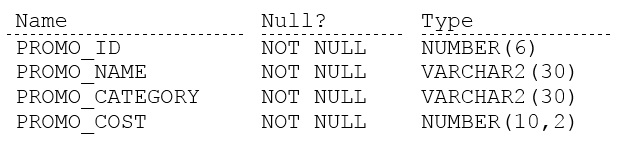

# Question 1
Examine the description of the PROMOTIONS table:

		
You want to display the unique promotion costs in each promotion category.
Which two queries can be used? (Choose two.)

# Answers
A.SELECT DISTINCT promo_category || ' has ' || promo_cost AS COSTS FROM promotions ORDER BY 1;

B.SELECT DISTINCT promo_cost || ' in ' || DISTINCT promo_category FROM promotions ORDER BY 1;

C.SELECT DISTINCT promo_category, promo_cost FROM promotions ORDER BY 1;

D.SELECT promo_category DISTINCT promo_cost, FROM promotions ORDER BY 2;

E.SELECT promo_cost, promo_category FROM promotions ORDER BY 1;

# Discussions
## Discussion 1
-- Distinct keyword is used to select the unique values of the column/combination of columns mentioned after the DISTINCT clause.
   
     Thus Option E is incorrect , as this does not use DISTINCT clause and might include duplicates.
	 
   -- Distinct should be used once in a SELECT statement and should be used IMMEDIATELY after the SELECT clause. NOT to be used before every column.
     
	 Thus Options D and B are incorrect, as the positioning of the DISTINCT clause is incorrect.
	 
   -- Option A and C are correct.
   
     Option A: Even though there is a string ' has ' in everyrow returned , the combination of promo_category  || ' has ' || promo_cost will still be distinct.
	 Option C: correct use case. ORDER BY clause does not affect the uniqueness in the returned result set.

## Discussion 2
AC are correct. DB have Distinct in a wrong position in the query and E returns all because of the missing DISTINCT

## Discussion 3
Distinct is used to get distinct set of values for one or more columns mentioned in select statement

## Discussion 4
B: Has two distincts in the statement. Not correct. 
D: The position of the distinct is not correct
E: it is not returning unique values.

## Discussion 5
AC are correct. DB have Distinct in a wrong position in the query and E returns all because of the missing DISTINCT

