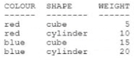
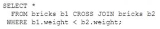

# Question 100
Examine the BRICKS table:

		
You write this query:

		
How many rows will the query return?

# Answers
A.4

B.6

C.16

D.0

E.1

F.10

# Discussions
## Discussion 1
The correct answer is B which is 6 rows

Explanation:
The CROSS JOIN operation combines each row from the first table with each row from the second table. Since the BRICKS table has 4 rows, the result of the CROSS JOIN will have 4 * 4 = 16 rows.

The WHERE clause filters out rows where b1.weight is not less than b2.weight. This means that only rows where the weight of the first brick is less than the weight of the second brick will be included in the result. There are 6 such combinations: (5,10), (5,15), (5,20), (10,15), (10,20), and (15,20). So the final result will have 6 rows.

## Discussion 2
B is the correct answer.

## Discussion 3
Option B is correct

## Discussion 4
checked in DB B is correct

## Discussion 5
Option B is correct

