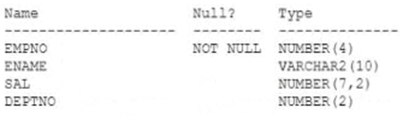
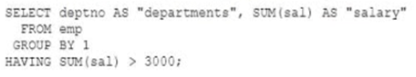

# Question 105
Examine this description of the EMP table:

		
You execute this query:

		
What is the result?

# Answers
A.only departments where the total salary is greater than 3000, returned in no particular order

B.only departments where the total salary is greater than 3000, ordered by department

C.all departments and a sum of the salaries of employees with a salary greater than 3000

D.an error

# Discussions
## Discussion 1
Answer D, since in GROUP BY clause must used column names instead positioned numbers like here, like GROUP BY deptno - works fine

## Discussion 2
D 
ORA-00979: not a GROUP BY expression

## Discussion 3
why D? A is correct

