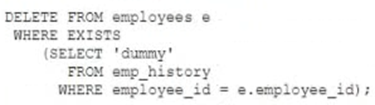

# Question 108
Examine this SQL statement:

		
Which two are true? (Choose two.)

# Answers
A.The DELETE statement executes successfully even if the subquery selects multiple rows.

B.The subquery is executed before the DELETE statement is executed.

C.The subquery is not a correlated subquery.

D.All existing rows in the EMPLOYEES table are deleted.

E.The subquery is executed for every row in the EMPLOYEES table.

# Discussions
## Discussion 1
A. The DELETE statement executes successfully even if the subquery selects multiple rows. This is because the EXISTS condition only checks for the existence of at least one row in the subquery, regardless of how many rows are returned.

E. The subquery is executed for every row in the EMPLOYEES table. This is because the subquery is a correlated subquery, which means that it references a column from the outer query (e.employee_id). As a result, the subquery must be executed once for each row in the EMPLOYEES table to determine whether the EXISTS condition is true or false for that row.

## Discussion 2
Why is B wrong?

## Discussion 3
AE is the correct answer

## Discussion 4
AE is correct

## Discussion 5
A,D.
Subquery isn't query before outer query.

