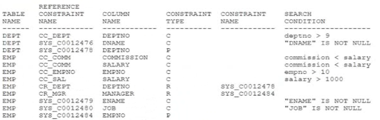

# Question 109
Examine this constraint information:

		
Which three statements are true? (Choose three.)

# Answers
A.The SALARY column must have a value.

B.The DEPTNO column in the EMP table can contain NULLS.

C.The COMMISION column can contain negative values.

D.The DEPTNO column in the EMP table can contain the value 1.

E.The MANAGER column is a foreign key referencing the EMPNO column.

F.The DNAME column has a unique constraint.

G.An index is created automatically in the MANAGER column.

# Discussions
## Discussion 1
i think BCE are correct

## Discussion 2
but how did we know that the manager is referencing the empno column ?!

## Discussion 3
BCE is Correct 

A. The SALARY column must have a value.  .............FALSE
B. The DEPTNO column in the EMP table can contain NULLS..........TRUE
C. The COMMISION column can contain negative values. ....TRUE
D. The DEPTNO column in the EMP table can contain the value 1...... TRUE WITH CONDITION. (If dept table primary key has 1 values)
E. The MANAGER column is a foreign key referencing the EMPNO column........ TRUE
F. The DNAME column has a unique constraint. FALSE
G. An index is created automatically in the MANAGER column....FALSE

## Discussion 4
I think B is wrong : The DEPTNO column in the EMP table can contain NULLS no because it refers to a PK so not possible.

## Discussion 5
As per the rule Primary and Composite Key can not contain Null value Then why  B option is right
I think A is right

