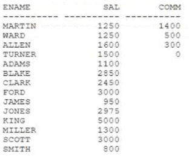

# Question 111
Examine this partial statement:
SELECT ename, sal, comm FROM emp
Now examine this output:

		
Which ORDER BY clause will generate the displayed output?

# Answers
A.ORDER BY comm DESC NULLS LAST, ename

B.ORDER BY NVL(coram, 0) ASC NULLS FIRST, ename

C.ORDER BY NVL(coram, 0) ASC NULLS LAST, ename

D.ORDER BY NVL(ccmm, 0) DESC, ename

# Discussions
## Discussion 1
D is not correct, because Turner is last in the table. A is correct answer

## Discussion 2
D also correct answer,, Tested and its giving expected output

## Discussion 3
A is the right answer.

## Discussion 4
I'd give it D

## Discussion 5
Tested on Oracle live sql.
A is correct query for the output
B comm nulls are at the top - wrong
C Turmer, Allen, Ward, Martin at the bottom - wrong
D Only Turner at the bottom - wrong

