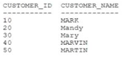
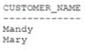

# Question 112
Examine the description of the CUSTOMERS table:

		
Which two SELECT statements will return these results: (Choose two.)

		

# Answers
A.SELECT customer_name FROM customers WHERE UPPER(customer_name) LIKE ‘MA*’;

B.SELECT customer_name FROM customers WHERE customer_name = ‘*Ma*’;

C.SELECT customer_name FROM customers WHERE customer_name LIKE ‘Ma*’;

D.SELECT customer_name FROM customers WHERE UPPER(customer_name) LIKE ‘MA%’;

E.SELECT customer_name FROM customers WHERE customer_name LIKE ‘%a%’;

F.SELECT customer_name FROM customers WHERE customer_name LIKE ‘Ma%’;

G.SELECT customer_name FROM customers WHERE customer_name LIKE ‘*Ma*’;

# Discussions
## Discussion 1
EF is correct

## Discussion 2
D is false - it will return all names (checked with SQL Developer)

## Discussion 3
EF is correct

## Discussion 4
F -for sure
C - is second closest if it was customer_name LIKE 'Ma%' but not when it is 'Ma*' as shown

## Discussion 5
D and F, %a% will return all names with letter a

