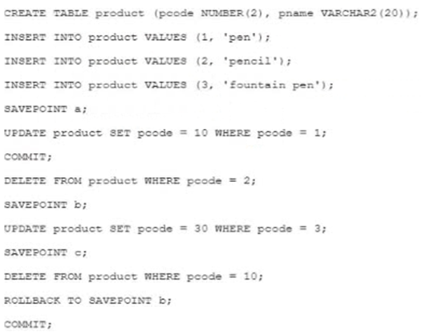

# Question 117
Examine these statements executed in a single Oracle session:

		
Which three statements are true? (Choose three.)

# Answers
A.The code for pen is 10.

B.There is no row containing fountain pen.

C.There is no row containing pen.

D.There is no row containing pencil.

E.The code for fountain pen is 3.

F.The code for pen is 1.

# Discussions
## Discussion 1
ADE is the correct answer

## Discussion 2
ADE is the right answer.

