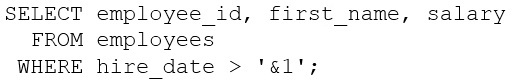

# Question 12
Examine this query:

		
Which two methods should you use to prevent prompting for a hire date value when this query is executed? (Choose two.)

# Answers
A.Use the DEFINE command before executing the query.

B.Replace '&1' with '&&1' in the query.

C.Use the UNDEFINE command before executing the query.

D.Execute the SET VERIFY OFF command before executing the query.

E.Execute the SET VERIFY ON command before executing the query.

F.Store the query in a script and pass the substitution value to the script when executing it.

# Discussions
## Discussion 1
B cannot be an option because the question says "Prevent prompting of hire date value". && will still prompt it once.

## Discussion 2
B. By replacing '&1' with '&&1' in the query, it creates a double-ampersand substitution variable which will remember the value of the variable throughout the session and will not prompt for a value every time it is used.

F. By storing the query in a script and passing the substitution value to the script when executing it, you can provide a value for the variable before the query is executed. This prevents the query from prompting for a value when it is executed.

## Discussion 3
It's confusing, if you replace &1 with &&1 it would still be asking for the value every time you run the query, it doesn't make sense to me... but if you previously used DEFINE to define that variable, it wouldn't. That's why I think AF is more accurate

## Discussion 4
AF are correct.
 B will promt once, but question asks for no prompting at all
C. UNDIFINE is not a thing
D/E Verify has nothing to do with prompting

## Discussion 5
Why is B not correct?..and someone explain how o store a query in a script, i cant get the concept..

