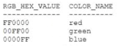
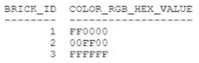
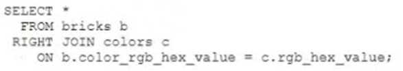
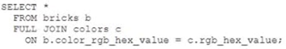
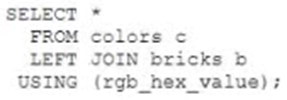
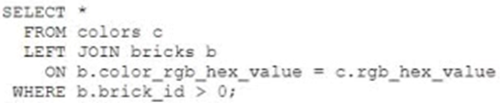
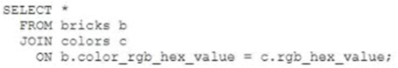

# Question 120
Examine the data in the COLORS table:

		
Examine the data in the BRICKS table:

		
Which two queries return all the rows from COLORS? (Choose two.)

# Answers
A.

		 

B.

		 

C.

		

D.

		

E.

		

# Discussions
## Discussion 1
Checked: A, B

Check:
CREATE TABLE COLORS_120
(
    RGB_HEX_VALUE   VARCHAR2(100)
,   COLOR_NAME      VARCHAR2(100)
);

CREATE TABLE BRIKS_120
(
    BRICK_ID    NUMBER
,   COLOR_RGB_HEX_VALUE     VARCHAR2(100)
);

INSERT INTO COLORS_120
SELECT 'FF0000','red' FROM DUAL
UNION ALL
SELECT '00FF00','green' FROM DUAL
UNION ALL
SELECT '0000FF','blue' FROM DUAL;

INSERT INTO BRIKS_120
SELECT 1,'FF0000' FROM DUAL
UNION ALL
SELECT 2,'00FF00' FROM DUAL
UNION ALL
SELECT 3,'FFFFFF' FROM DUAL;

A;
SELECT * 
FROM BRIKS_120 b
RIGHT JOIN COLORS_120 c
ON b.COLOR_RGB_HEX_VALUE = c.RGB_HEX_VALUE;

B;
SELECT * 
FROM BRIKS_120 b
FULL JOIN COLORS_120 c
ON b.COLOR_RGB_HEX_VALUE = c.RGB_HEX_VALUE;

C;
SELECT * 
FROM  c
FULL JOIN BRIKS_120 b
USING(RGB_HEX_VALUE);

D;
SELECT * 
FROM COLORS_120 c
LEFT JOIN BRIKS_120 b
ON b.COLOR_RGB_HEX_VALUE = c.RGB_HEX_VALUE
WHERE b.brick_id > 0
;
E;
SELECT * 
FROM BRIKS_120 b
LEFT JOIN COLORS_120 c
ON b.COLOR_RGB_HEX_VALUE = c.RGB_HEX_VALUE;

## Discussion 2
AB ARE THE ANSWERS

## Discussion 3
AB are the answers

## Discussion 4
A, B is correct. tried.

## Discussion 5
Not possible to use the using clause as the names of the columns are not the same. For me AB is the correct answer.

