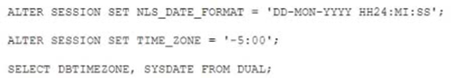
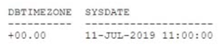

# Question 122
Examine these statements which execute successfully:

		
Examine the result:

		
If LOCALTIMESTAMP was selected at the same time, what would it return?

# Answers
A.11-JUL-2019 6.00.00.00000000 AM -05:00

B.11-JUL-2019 11.00.00.00000000 AM

C.11-JUL-2019 6.00.00.00000000 AM

D.11-JUL-2019 11.00.00.00000000 AM -05:00

# Discussions
## Discussion 1
* LOCALTIMESTAMP returns the local time with the time zone offset included (-05:00 )

## Discussion 2
C - because Localtimestamp is from the session which we've set to -5

## Discussion 3
Correct Answer is B

