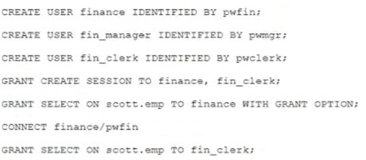

# Question 123
Examine these statements which execute successfully:

		
Which two are true? (Choose two.)

# Answers
A.User FIN_CLERK can grant SELECT on SCOTT.EMP to user FIN_MANAGER.

B.Dropping user FINANCE will automatically revoke SELECT on SCOTT.EMP from user FIN_CLERK.

C.User FINANCE can grant CREATE SESSION to user FIN_MANAGER.

D.Revoking SELECT on SCOTT.EMP from user FINANCE will also revoke the privilege from user FIN_CLERK.

E.User FINANCE is unable to grant all on SCOTT.EMP to FIN_MANAGER.

# Discussions
## Discussion 1
BDE.  B is right, because dropping a user implies to REVOKE all OBJECT PRIVILEGES granted by this user.  Pay attention in the difference between object privileges and system privileges.  System privileges must be revoked directly from user who has them.

## Discussion 2
When I tested this one, BD were true and E returned grant succeeded.  However when I tested to see if those table privileges had actually been granted by E, the recipient had none of those abilities.

## Discussion 3
A, D 
A. User FIN_CLERK can grant SELECT on SCOTT.EMP to user FIN_MANAGER - This is true because user FINANCE has been granted SELECT privilege on SCOTT.EMP with the GRANT OPTION, and user FINANCE subsequently granted SELECT on SCOTT.EMP to user FIN_CLERK. The GRANT OPTION allows the privilege to be further granted to other users.

D. Revoking SELECT on SCOTT.EMP from user FINANCE will also revoke the privilege from user FIN_CLERK - This is true because when a privilege is revoked from a user who was granted the privilege with the GRANT OPTION, and who subsequently granted that privilege to other users, then the privilege is also revoked from the other users.

## Discussion 4
This is from official Oracle course: "If a user leaves the company and you revoke his or her privileges, you must re-grant any privileges that this user granted to other users. If you drop the user account without revoking privileges from it, the system privileges granted by this user to other users are not affected by this action."

## Discussion 5
why E is not correct?

