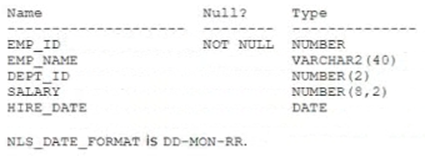

# Question 125
Examine the description of the EMPLOYEES table:

		
Which two queries will execute successfully? (Choose two.)

# Answers
A.SELECT dept_id, AVG(MAX(salary)) FROM employees GROUP BY dept_id HAVING hire_date > '01-JAN-19';

B.SELECT dept_id, SUM(salary) FROM employees WHERE hire_date > '01-JAN-19' GROUP BY dept_id;

C.SELECT dept_id, MAX(SUM(salary)) FROM employees GROUP BY dept_id;

D.SELECT dept_id, AVG(MAX(salary)) FROM employees GROUP BY dept_id, salary;

E.SELECT AVG(MAX(salary)) FROM employees GROUP BY salary;

# Discussions
## Discussion 1
I think answer B is the only correct answer because In SQL, a group function operates on a set of rows and returns a single value for each group. Group functions include AVG, COUNT, MAX, MIN, and SUM. These functions cannot be nested within one another. For example, in query A, the AVG function is nested within the MAX function which is not allowed. Similarly, in query C, D and E, the MAX function is nested within the AVG function which is also not allowed. 
What do you think?

## Discussion 2
BE is the correct answer

## Discussion 3
BE tested

## Discussion 4
Tested.
A. not a GROUP BY expression
C.D boths are not a single-group group function

## Discussion 5
BE tested

