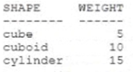
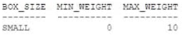
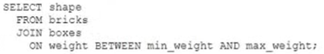
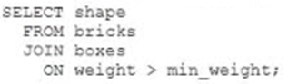
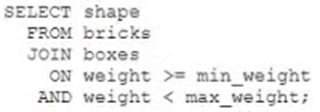
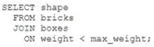
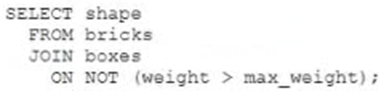

# Question 127
Examine data in the BRICKS table:

		
Examine the BOXES table:

		
Which two queries only return CUBE? (Choose two.)

# Answers
A.

		

B.

		

C.

		 

D.

		 

E.

		

# Discussions
## Discussion 1
CD is right answer.

## Discussion 2
CD correct

## Discussion 3
Between includes the upper and lower bounds

