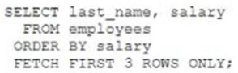

# Question 128
Which two statements will return the names of the three employees with the lowest salaries? (Choose two.)

# Answers
A.

		

B.

		 

C.

		 

D.

		

E.

		

# Discussions
## Discussion 1
A. select last_name, salary from employees
fetch first 3 rows only 
order by salary;
- results in an error
---------------------------------------------
B. select last_name, salary from ( select * from employees order by salary)
where rownum <= 3;
- works
-------------------------------------------------------
c. select last_name, salary from employees
order by salary
  fetch first 3 rows only ;
- works
----------------------------------------------------------------
D. select last_name, salary from employees where rownum <= 3 order by salary;
- returns the first 3 rows and orders the 3 rows based on salary so its incorrect
-------------------------------------------------------
E. select last_name, salary from employees where rownum <= 3 order by (select salary from employees);
- subquery returns more than one row so results in error

## Discussion 2
D is wrong
after order  by rownum might not anymore be sequential.

## Discussion 3
D is the correct answer

