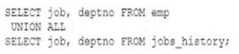

# Question 129
Examine this query which executes successfully:

		
What will be the result?

# Answers
A.It will return rows from both SELECT statements including duplicate rows.

B.It will return rows from both SELECT statements after eliminating duplicate rows.

C.It will return rows that are not common to both SELECT statements.

D.It will return rows common to both SELECT statements.

# Discussions
## Discussion 1
union all includes duplicates

