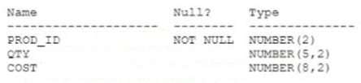
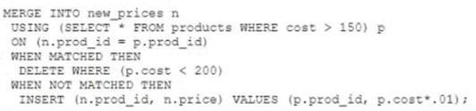
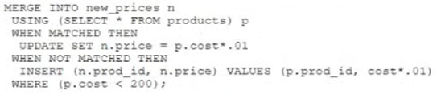
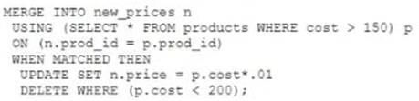
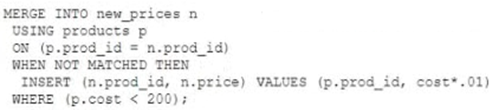

# Question 131
Examine this description of the PRODUCTS table:

		
You successfully execute this command:
CREATE TABLE new_prices (prod_id NUMBER(2), price NUMBER(8,2))
Which two statements execute without errors? (Choose two.)

# Answers
A.

		

B.

		

C.

		 

D.

		 

# Discussions
## Discussion 1
A. wrong, missing update in when matched clause,
B. wrong, missing ON clause.
C. correct
D. correct

## Discussion 2
checked

