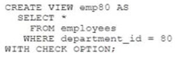
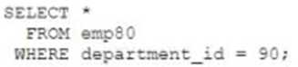
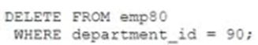
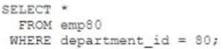
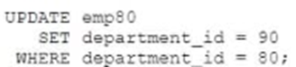

# Question 133
Examine this statement which executes successfully:

		
Which statement will violate the CHECK constraint?

# Answers
A.

		

B.

		

C.

		

D.

		 

# Discussions
## Discussion 1
i vote for D

## Discussion 2
D is the correct

https://www.oracletutorial.com/oracle-view/oracle-with-check-option/

## Discussion 3
D is correct

## Discussion 4
D is the correct answer

## Discussion 5
D is the correct answer, but what is the correct answer in a real exam?

