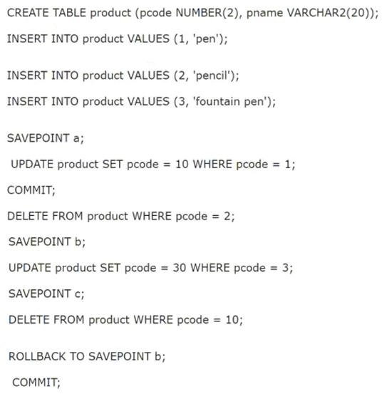

# Question 142
Examine these statements executed in a single Oracle session:

		
Which three statements are true? (Choose three.)

# Answers
A.There is no row containing pencil.

B.The code for pen is 10.

C.There is no row containing fountain pen.

D.The code for pen is 1.

E.There is no row containing pen.

F.The code for fountain pen is 3.

# Discussions
## Discussion 1
100% ABF

## Discussion 2
ABF is the answer

## Discussion 3
ABF is the correct answer

## Discussion 4
ABF is correct

## Discussion 5
ABF is correct

