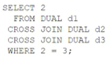

# Question 144
Examine this query:

		
What is the result?

# Answers
A.an error

B.no rows

C.1 row

D.3 rows

E.6 rows

F.8 rows

# Discussions
## Discussion 1
B is the correct answer

## Discussion 2
Checked, B is correct.

## Discussion 3
B is correct

## Discussion 4
Where condition is not correct

## Discussion 5
B is correct , return 0 row

