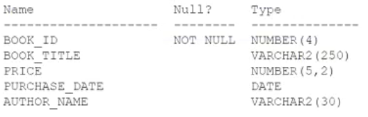
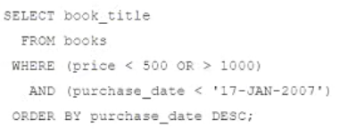
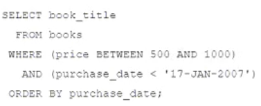
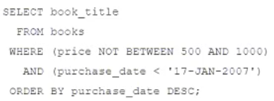
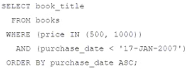
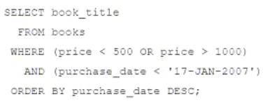

# Question 146
Examine the description of the BOOKS table:

		
Examine these requirements:
1. Display book titles for books purchased before January 17, 2007 costing less than 500 or more than 1000.
2. Sort the titles by date of purchase, starting with the most recently purchased book.
Which two queries can be used? (Choose two.)

# Answers
A.

		

B.

		

C.

		 

D.

		

E.

		 

# Discussions
## Discussion 1
A is not valid .
CE is the correct

## Discussion 2
CE is correct

## Discussion 3
CE is correct A have incorrect syntax

## Discussion 4
CE is correct.
A - where condition should have 'price' as well for 1000
B - where condition 'between 500 and 1000' does not satisfy what is asked; 'order by' clause's default is ascending
D - where condition 'price IN (500,1000)' and order by ASC is wrong

## Discussion 5
A results in an error and to get the most recent you need to order by desc

