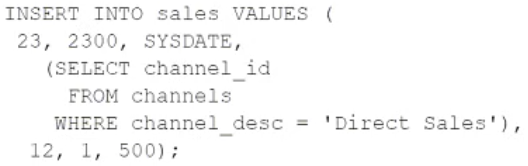

# Question 147
View the Exhibit and examine the description of the tables.
You execute this SQL statement:

		
Which three statements are true? (Choose three.)

# Answers
A.The statement will execute successfully and a new row will be inserted into the SALES table.

B.A product can have a different unit price at different times.

C.The statement will fail if a row already exists in the SALES table for product 23.

D.The statement will fail because a subquery may not be contained in a VALUES clause.

E.A customer can exist in many countries.

F.The SALES table has five foreign keys.

# Discussions
## Discussion 1
See answer below. ERD is missing

## Discussion 2
ABF is correct based on this erd : https://www.examtopics.com/assets/media/exam-media/02818/0021800001.jpg

## Discussion 3
ERD MISSING

## Discussion 4
https://www.examtopics.com/assets/media/exam-media/02818/0021800001.jpg

## Discussion 5
ERD is missing 
Check https://www.examtopics.com/discussions/oracle/view/9455-exam-1z0-071-topic-1-question-249-discussion/https://www.examtopics.com/discussions/oracle/view/9455-exam-1z0-071-topic-1-question-249-discussion/

