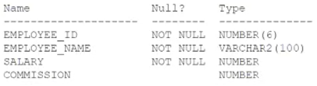

# Question 149
Examine the description of EMPLOYEES table:

		
Which three queries return all rows for which SALARY + COMMISSION is greater than 20000? (Choose three.)

# Answers
A.SELECT * FROM employees WHERE NVL2(salary + commission, salary + commission, salary) >= 20000;

B.SELECT * FROM employees WHERE salary + NVL2(commission, commission, 0) >= 20000

C.SELECT * FROM employees WHERE NVL(salary + commission, 0) >= 20000;

D.SELECT * FROM employees WHERE salary + NULLIF(commission, 0) >= 20000;

E.SELECT * FROM employees WHERE COALESCE(salary, commission) >= 20000;

F.SELECT * FROM employees WHERE salary + NVL(commission, 0) >= 20000;

# Discussions
## Discussion 1
ABF is the correct answer

## Discussion 2
ABF is the correct answer

## Discussion 3
ninguna, la pregunta es  GREATER THAN 20000, y todas son  >=

