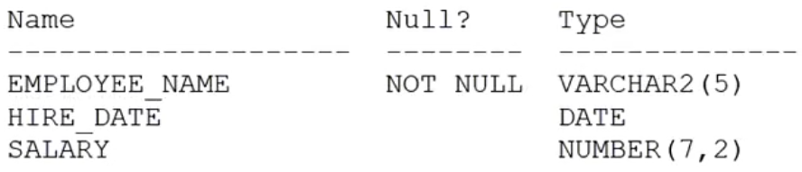

# Question 150
Examine the description of EMPLOYEES table:

		
The session time zone is the same as the database server.
Which two statements will list only the employees who have been working with the company for more than five years? (Choose two.)

# Answers
A.SELECT employee_name FROM employees WHERE (SYSDATE - hire_date) / 12 > 5;

B.SELECT employee_name FROM employees WHERE (SYSTIMSSTAMF - hire_date) / 12 > INTERVAL '5' YEAR;

C.SELECT employee_name FROM employees WHERE (CURRENT_DATE - hire_date) / 12 > 5

D.SELECT employee_name FROM employees WHERE (CURRENT_DATE - hire_date) / 365 >

E.SELECT employee_name FROM employees WHERE (SYSDATE - hire_date) / 365 > 5;

F.SELECT employee_name FROM employees WHERE (SYSTIMESTAMP - hire_date) / 365 > INTERVAL '1825' DAY;

# Discussions
## Discussion 1
DE is correct (even though D seems to be with typo). 
F is not correct as default precision of DAY is 2 - should be INTERVAL '1845' DAY(4)

## Discussion 2
DE is correct

## Discussion 3
I think EF.
D is with typo?

## Discussion 4
DE should be the correct answer

## Discussion 5
both SYSDATE AND HIRE_DATE AR OF TYPE date, SO SUBTRACTING IS VALID. rest are invalid.

