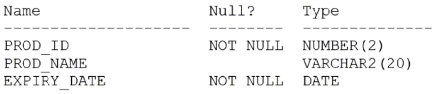

# Question 156
Examine the description of the PRODUCTS table which contains data:

		
Which two are true? (Choose two.)

# Answers
A.The PROD_NAME column cannot have a DEFAULT clause added to it.

B.The EXPIRY_DATE column cannot be dropped.

C.The EXPIRY_DATE column data type can be changed to TIMESTAMP.

D.The PROD_ID column can be renamed.

E.The PROD_ID column data type can be changed to VARCHAR2(2).

# Discussions
## Discussion 1
in case of empty table correct will be C,E,D. But in case of existing data in the table correct will be C,D. Impossible to change datatype. System raise an error: "ORA-01439: column to be modified must be empty to change datatype"

## Discussion 2
100% C AND D
HAVE A TRY:
CREATE TABLE PRODUCTS_156 
    (
    PROD_ID NUMBER(2) NOT NULL, 
    PROD_NAME VARCHAR2(20), 
    EXPIRY_DATE DATE
    );
INSERT INTO PRODUCTS_156
VALUES (1, 'Product 1', TO_DATE('2023-12-31', 'YYYY-MM-DD'));
ALTER TABLE PRODUCTS_156 MODIFY EXPIRY_DATE TIMESTAMP;
alter table products_156 rename column prod_id to product_id;
alter table products_156 modify product_id varchar(2); 
(CHANGE DATA TYPE NOT ALLOWED WITH EXISTING DATA IN THE TABLE).

## Discussion 3
ORA-01439: column to be modified must be empty to change datatype
D is ok cos the same group of datatype

## Discussion 4
C works well when i run sql statement.

## Discussion 5
C. The EXPIRY_DATE column data type can be changed to TIMESTAMP.

This is true. In Oracle, you can modify the data type of a DATE column to a TIMESTAMP data type using the ALTER TABLE statement, as long as there are no incompatible data types involved.
D. The PROD_ID column can be renamed.

This is true. Oracle allows you to rename columns in a table using the ALTER TABLE statement with the RENAME COLUMN clause.

