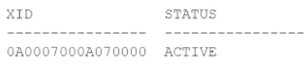

# Question 159
You currently have an active transaction in your session and have been granted SELECT access to
V$TRANSACTION.
Executing:
SELECT xid, status FROM v$transaction;
in your session returns:

		
In which three situations will re-executing this query still return a row but with a different XID, indicating a new transaction has started? (Choose three.)

# Answers
A.after successfully executing a CREATE TABLE statement followed by a CREATE INDEX statement

B.after successfully executing a TRUNCATE statement followed by a DML statement

C.after successfully executing a DML statement following a failed DML statement

D.after successfully executing a CREATE TABLE AS SELECT statement followed by a SELECT FOR UPDATE statement

E.after successfully executing a COMMIT or ROLLBACK followed by a DML statement

F.after successfully executing a COMMIT or ROLLBACK followed by a SELECT statement

# Discussions
## Discussion 1
A. after successfully executing a CREATE TABLE statement followed by a CREATE INDEX statement CREATE WILL END THE TRANSACTION BUT AGAIN CREATE INDEX WILL NOT START NEW TRANSACTION. FALSE
B. after successfully executing a TRUNCATE statement followed by a DML statement. TRUNC WILL END TRANS... AND LET SUPPOSE DML IS NOT SELECT IN THIS CASE SO THIS IS A POSSIBLE TRUE. TRUE
C. after successfully executing a DML statement following a failed DML statement. DML WILL NOT END TRANSATION AT ALL. FALSE
D. after successfully executing a CREATE TABLE AS SELECT statement followed by a SELECT FOR UPDATE statement. CREATE IS DDL WHICH IS IMPLICIT COMIT AND SELECT FOR UPDATE IS A START OF NEW TRANSACTION. TRUE
E. after successfully executing a COMMIT or ROLLBACK followed by a DML statement. SO COMIT END TRANSACTION AND DML CAN POTENTIALLY START NEW TRANSACTION (OTHER THAN SELECT). TRUE
F. after successfully executing a COMMIT or ROLLBACK followed by a SELECT statement. TRANSACTION ENDS HOWEVER ONLE SELECT, LET SAY SELEC * FROM EMP WILL NOT START A NEW TRANSACTION. FALSE
TRUE ---- BDE

## Discussion 2
BDE is correct, tested all on DB.
F is incorrect as SELECT is a limited DML statement which means it can only access data in the database, it cannot manipulate data.

## Discussion 3
BDE is correct

## Discussion 4
BEST ANSWERS

## Discussion 5
C because each DML starts a new transaction.

