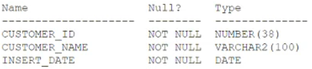

# Question 162
Examine the description of the CUSTOMERS table:

		
Which two statements will do an implicit conversion? (Choose two.)

# Answers
A.SELECT * FROM customers WHERE customer_id - '0001';

B.SELECT * FROM customers WHERE customer_id - 0001;

C.SELECT * FROM customers WHERE insert_date - DATE '2019-01-01';

D.SELECT * FROM customers WHERE insert_date - '01-JAN-19';

E.SELECT * FROM customers WHERE TO_CHAR(customer_id) - '0001';

# Discussions
## Discussion 1
AD must be correct.
C is not an implicit conversion

## Discussion 2
I think AD is correct

## Discussion 3
A D are correct

## Discussion 4
A D are correct

## Discussion 5
D i am getting an error ORA-01722: invalid number

