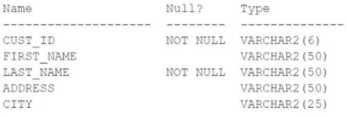

# Question 164
Examine the description of the CUSTOMERS table:

		
You want to display details of all customers who reside in cities starting with the letter D followed by at least two characters.
Which query can be used?

# Answers
A.SELECT * FROM customers WHERE city LIKE ‘D__%’;

B.SELECT * FROM customers WHERE city = ‘%D__’;

C.SELECT * FROM customers WHERE city = ‘D__%’;

D.SELECT * FROM customers WHERE city LIKE ‘D__’;

# Discussions
## Discussion 1
I think A should be correct .
A. city LIKE ‘D__%’

## Discussion 2
A is correct

## Discussion 3
A is correct.

## Discussion 4
A is correct

## Discussion 5
A is correct

