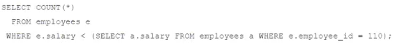
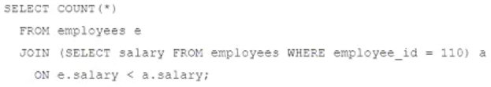
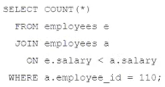
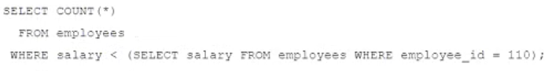

# Question 166
You must find the number of employees whose salary is lower than employee 110.
Which statement fails to do this?

# Answers
A.

		 

B.

		

C.

		

D.

		

# Discussions
## Discussion 1
fail A -  because in the subquery exist condition referenced to main table but not subquery table. By other words, in the subquery not exist limitation for fetching rows and subquery return more than one row

## Discussion 2
is the A 
the correct A is 
select count(*)
from hr.employees e
where e.salary < (select a.salary from hr. employees a where a.employee_id=110);

## Discussion 3
alic_alex, I am sorry but where did you see the EXIST condition in A?

## Discussion 4
A fails

## Discussion 5
A -failed with "ORA-01427: single-row subquery returns more than one row"

