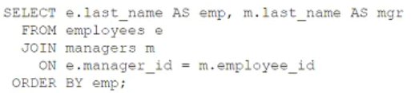

# Question 167
Examine this statement which returns the name of each employee and their manager:

		
You want to extend the query to include employees with no manager. What must you add before JOIN to do this?

# Answers
A.CROSS

B.RIGHT OUTER

C.LEFT OUTER

D.FULL OUTER

# Discussions
## Discussion 1
•	LEFT OUTER JOIN:
o	Returns all rows from the employees table, regardless of whether there is a matching row in the managers table.
o	For employees without a manager, the columns from the managers table will contain NULL.

## Discussion 2
C is correct. 
The manager table needs to be fully preserved.

