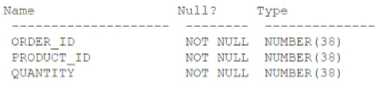

# Question 169
Examine the ORDER_ITEMS table:

		
Which two queries return rows where QUANTITY is a multiple of ten? (Choose two.)

# Answers
A.SELECT * FROM order_items WHERE quantity / 10 - TRUNC(quantity

B.SELECT * FROM order_items WHERE MOD(quantity, 10) - 0;

C.SELECT * FROM  order_items WHERE FLOOR(quantity / 10) = TRUNC(quantity / 10);

D.SELECT * FROM  order_items WHERE quantity = TRUNC(quantity,  -1);

E.SELECT * FROM  order_items WHERE quantity = ROUND(quantity,  1);

# Discussions
## Discussion 1
BD is correct

## Discussion 2
B has a typo , should be = 0

## Discussion 3
B. SELECT * FROM order_items WHERE MOD(quantity, 10) = 0;

This is correct. The MOD function returns the remainder of a division operation. If MOD(quantity, 10) equals 0, it means that quantity is evenly divisible by 10, i.e., quantity is a multiple of 10.
C. SELECT * FROM order_items WHERE FLOOR(quantity / 10) = TRUNC(quantity / 10);

This is correct. FLOOR(quantity / 10) and TRUNC(quantity / 10) will both give the same result when quantity is a multiple of 10, because the division of a multiple of 10 by 10 will always be an integer. This ensures that quantity is a multiple of 10.

## Discussion 4
B and C. 
B) there is a typo, should be = 0 not - 0. 
C) LOOR(quantity / 10) = TRUNC(quantity / 10) return the same value, indicating quantity is a multiple of 10.

## Discussion 5
C, D IS CORRECT

