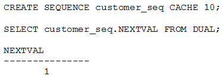
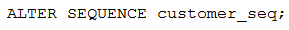

# Question 175
Examine these statements and the result:

		
Now examine this command:

		
What must replace MISSING CLAUSE for CUSTOMER_SEQ.NEXTVAL to return 11?

# Answers
A.NOCACHE

B.INCREMENT BY 10

C.START WITH 11

D.MINVALUE 11

E.CYCLE 11

# Discussions
## Discussion 1
I think B is correct

## Discussion 2
Tested.

## Discussion 3
I creating sequence - create sequence customer_seq cache 10;
What I get from alter sequence customer_seq:
A. NOCACHE – NEXTVAL 1
B. INCREMENT BY 10 - NEXTVAL 10.
C. START WITH 11 - ORA-02283: cannot alter starting sequence number 
D. MINVALUE 11 - ORA-04007: MINVALUE cannot be made to exceed the current value 
E. CYCLE 11 - ORA-00933: SQL command not properly ended

## Discussion 4
TESTED : Correct answer is B

NOCACHE          --> NEXTVAL =2;
INCREMENT BY 10  --> NEXTVAL =11;
START WITH 11    --> ORA ERROR - CANNOT ALTER SEQUENCE STARTING NUMBER
MINVALUE 11      --> ORA ERROR - MINVALUE CANNOT BE MADE TO EXCEED THE CURRENT VALUE
CYCLE 11         --> ORA ERROR - SQL COMMAND NOT PROPERLY ENDED

## Discussion 5
Tested twice. B

