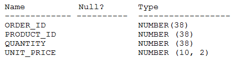

# Question 176
Examine the description of the ORDER_ITEMS table:

		
Examine this incomplete query:

		
Which two can replace
so the query completes successfully?

# Answers
A.quantity * unit_price

B.quantity

C.total_paid

D.product_id

E.quantity, unit_price

# Discussions
## Discussion 1
AC is the answer checked

## Discussion 2
AC is correct

