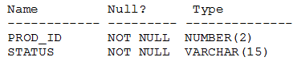

# Question 179
Examine the description of the PRODUCT_STATUS table:

		
The STATUS column contains the values IN STOCK or OUT OF STOCK for each row. Which two queries will execute successfully?

# Answers
A.SELECT prod_id || q”’s not available” FROM product_status WHERE status = ‘OUT OF STOCK’;

B.SELECT prod_id || q’(‘s not available)’ ‘CURRENT AVAILABILITY’ FROM product_status WHERE status = ‘OUT OF STOCK’;

C.SELECT prod_id q’s not available” FROM product_status WHERE status = ‘OUT OF STOCK’;

D.SELECT prod_id “CURRENT AVAILABILITY” || q’(‘s not available)’ FROM product_status WHERE status = ‘OUT OF STOCK’;

E.SELECT prod_id || q’(‘s not available)’ FROM product_status WHERE status = ‘OUT OF STOCK’;

F.SELECT prod_id || q’(‘s not available)’ “CURRENT AVAILABILITY” FROM product status WHERE status = ‘OUT OF STOCK’;

# Discussions
## Discussion 1
E;F tested

## Discussion 2
E, F are right.

## Discussion 3
Tested  column aliases cannot before the concatination unless you want to also inclunde them which means you need to add another ||

## Discussion 4
EF are correct.
A is incorrect as there are single & double commas instead of single commas only. Others are obviously wrong.

## Discussion 5
EF should be the correct answer

