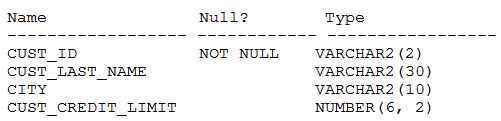

# Question 182
Examine the description of the CUSTOMERS table:

		
You need to display last names and credit limits of all customers whose last name starts with A or B in lower or upper case, and whose credit limit is below 1000.
Examine this partial query:
SELECT cust_last_name, cust_credit_limit FROM customers
Which two WHERE conditions give the required result?

# Answers
A.WHERE UPPER(cust_last_name) IN (‘AX’, ‘B%’)AND cust_credit_limit < 1000;

B.WHERE (UPPER(cust_last_name) LIKE ‘A%’ OR UPPER(cust_last_name) LIKE ‘B%’)AND ROUND(cust_credit_limit) < 1000;

C.WHERE UPPER(cust_last_name) BETWEEN UPPER(‘A%’ AND ‘B%’)AND ROUND(cust_credit_limit) < 1000;

D.WHERE (INITCAP(cust_last_name) LIKE ‘A%’ OR INITCAP(cust_last_name) LIKE ‘B%’)AND cust_credit_limit < 1000;

E.WHERE (UPPER(cust_last_name) LIKE INITCAP(‘A’) OR UPPER(cust_last_name) LIKE INITCAP(‘B’))AND ROUND(cust_credit_limit) < ROUND(1000);

# Discussions
## Discussion 1
BD tested

## Discussion 2
For option B, what if cust_credit_limit = 999.6?

## Discussion 3
BD is correct

## Discussion 4
BD must be right

## Discussion 5
only D, 
B not  in case cust_credit_limit =1000.45

