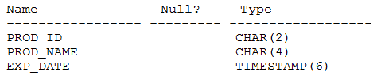
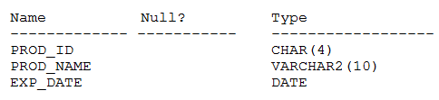

# Question 185
Examine the description PRODUCTS table:

		
Examine the description of the NEW_PRODUCTS table:

		
Which two queries execute successfully?

# Answers
A.SELECT prod_id FROM products -UNION ALL -SELECT prod_id, prod_name FROM new_products;

B.SELECT prod_id, exp_date FROM productsUNION ALL -SELECT prod_id, NULL FROM new_products;

C.SELECT * FROM products -MINUS -SELECT prod_id, FROM new_products;

D.SELECT prod_id, prod_name FROM productsINTERSECT -SELECT 100, prod_name FROM new_products;

E.SELECT * FROM products -UNION -SELECT * FROM new_products;

# Discussions
## Discussion 1
B,E
create table products (prod_id char(2), prod_name char(4), exp_date timestamp(6));

create table new_products (prod_id char(4), prod_name varchar2(10), exp_date DATE);

/*A NOOK 01789. 00000 -  "query block has incorrect number of result columns"*/
SELECT prod_id FROM products 
UNION ALL 
SELECT prod_id, prod_name FROM new_products;

/*B OK.*/
SELECT prod_id, exp_date FROM products
UNION ALL 
SELECT prod_id, NULL FROM new_products;

/*C NOOK 01789. 00000 -  "query block has incorrect number of result columns"*/
SELECT * FROM products
MINUS 
SELECT prod_id FROM new_products;

/*D NOOK 01790. 00000 -  "expression must have same datatype as corresponding expression"*/
SELECT prod_id, prod_name FROM products
INTERSECT 
SELECT 100, prod_name FROM new_products;

/*E OK*/
SELECT * FROM products 
UNION 
SELECT * FROM new_products;

## Discussion 2
BE Correct. Tested
Thanks Santi.

## Discussion 3
BE correct.  Please update these answers

## Discussion 4
BE tested

## Discussion 5
BE correct

