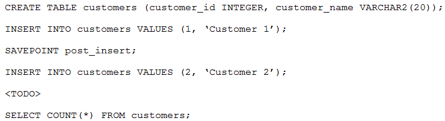

# Question 189
You execute these commands:

		
Which two, used independently, can replace
so the query returns 1?

# Answers
A.ROLLBACK;

B.ROLLBACK TO SAVEPOINT post_insert;

C.ROLLBACK TO post_insert;

D.COMMIT;

E.COMMIT TO SAVEPOINT post_insert;

# Discussions
## Discussion 1
BC is correct as the word savepoint is optionnal.

## Discussion 2
E is invalid.

BC is correct

## Discussion 3
BC is correct

## Discussion 4
BC is the correct answer since SAVEPOINT is optional in ROLLBACK there's no such thing as COMMIT TO SAVEPOINT

## Discussion 5
BD is correct answer.

