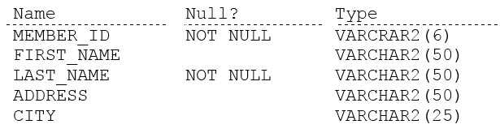

# Question 19
Examine the description of the MEMBERS table:

		
Examine the partial query:
SELECT city, last_name AS lname FROM members ...;
You want to display all cities that contain the string AN. The cities must be returned in ascending order, with the last names further sorted in descending order.
Which two clauses must you add to the query? (Choose two.)

# Answers
A.ORDER BY 1, 2

B.ORDER BY 1, lname DESC

C.WHERE city IN ('%AN%')

D.WHERE city = '%AN%'

E.WHERE city LIKE '%AN%'

F.ORDER BY last_name DESC, city ASC

# Discussions
## Discussion 1
lname is in the question
SELECT city, last_name AS lname FROM members

## Discussion 2
Option BE is right!

## Discussion 3
B-E IS CORRECT.

## Discussion 4
EF cannot be right. As the question asks us to first sort by cities in the ascending order. Only then further the sorting requires for lastname is descending order. F does vice versa

## Discussion 5
BE is correct

