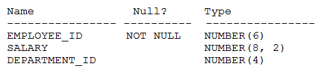

# Question 190
Examine the description of the EMPLOYEES table:

		
Which two queries return the highest salary in the table?

# Answers
A.SELECT MAX(salary)FROM employees -GROUP By department_id -HAVING MAX(salary) = MAX(MAX(salary));

B.SELECT MAX(salary)FROM employees -GROUP By department_id;

C.SELECT department_id, MAX(salary)FROM employees -GROUP By department_id;

D.SELECT MAX(salary)FROM employees;

E.SELECT MAX(MAX(salary))FROM employees -GROUP By department_id;

# Discussions
## Discussion 1
DE is correct

## Discussion 2
D and E is correct.
A produce an error
B and C select highest salary based on department
D and E select highest salary in the table

## Discussion 3
DE are correct answers

## Discussion 4
how is it not C & D? E doesn't make sense?

## Discussion 5
DE tested

