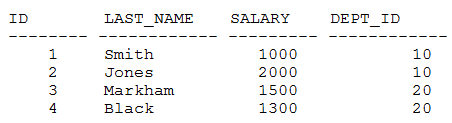

# Question 191
Examine this data in the EMPLOYEES table:

		
Which statement will execute successfully?

# Answers
A.SELECT dept_id, INSTR(last_name, ‘A’), SUM(salary) FROM employees GROUP BY dept_id;

B.SELECT dept_id, STDDEV(last_name), SUM(salary) FROM employees GROUP BY dept_id;

C.SELECT dept_id, LENGTH(last_name), SUM(salary) FROM employees GROUP BY dept_id;

D.SELECT dept_id, MAX(last_name), SUM(salary) FROM employees GROUP BY dept_id;

# Discussions
## Discussion 1
D is correct

## Discussion 2
Admins, why so many questions are marked incorrectly?

## Discussion 3
C is invalid and returns the error : 
ORA-00979: not a GROUP BY expression

## Discussion 4
D tested

## Discussion 5
D is correct

