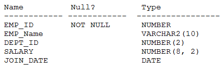

# Question 192
Examine the description of the EMPLOYEES table:

		
NLS_DATE_FORMAT is set to DD-MON-YY.
Which query requires explicit data type conversion?

# Answers
A.SELECT join_date FROM employees WHERE join_datee > ’10-02-2018’;

B.SELECT join_date || ‘ ‘ || salary FROM employees;

C.SELECT salary + ’120.50’ FROM employees;

D.SELECT join_date + ‘20’ FROM employees;

E.SELECT SUBSTR(join_date, 1, 2) -1’

# Discussions
## Discussion 1
A is the correct answer

## Discussion 2
All executed without error.

## Discussion 3
A, B, D, and E require explicit data type conversion.

## Discussion 4
https://www.examtopics.com/discussions/oracle/view/13453-exam-1z0-071-topic-1-question-296-discussion/

## Discussion 5
D is executed without conversion.

A is the correct

