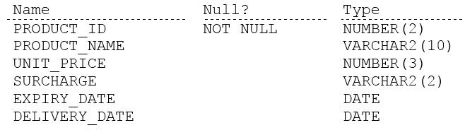

# Question 2
Examine the description of the PRODUCTS table:

		
Which three queries use valid expressions? (Choose three.)

# Answers
A.SELECT product_id, unit_price, S "Discount", unit_price + surcharge - discount FROM products;

B.SELECT product_id, (unit_price * 0.15 / (4.75 + 552.25)) FROM products;

C.SELECT product_id, (expiry_date - delivery_date) * 2 FROM products;

D.SELECT product_id, unit_price || 5 "Discount", unit_price + surcharge - discount FROM products;

E.SELECT product_id, expiry_date * 2 FROM products;

F.SELECT product_id, unit_price, unit_price + surcharge FROM products;

# Discussions
## Discussion 1
BCE should be correct answer cause number+varchar in this case imspossible

## Discussion 2
IT is correct BCF because in the Datatype Varchar2 there may be a number. Oracle makes it an implicit cast and uses it as a number

## Discussion 3
you cant multiply date, BCF correct if varchar2 is number

## Discussion 4
Seems like a sketchy question, have to assume surcharge contains only numerical characters in the string for F

## Discussion 5
BCF 
The three queries that use valid expressions are:

B. SELECT product_id, (unit_price * 0.15 / (4.75 + 552.25)) FROM products;

C. SELECT product_id, (expiry_date - delivery_date) * 2 FROM products;

F. SELECT product_id, unit_price, unit_price + surcharge FROM products;

Explanation:

A. This query is invalid because the alias "S" is not defined anywhere in the query.

B. This query is valid. It calculates a value based on the unit price of each product using a mathematical expression.

C. This query is valid. It calculates the difference between the expiry date and delivery date for each product and multiplies it by 2.

D. This query is invalid because the alias "discount" is not defined anywhere in the query.

E. This query is invalid because you cannot multiply a date value by a number.

F. This query is valid. It selects the product ID, unit price, and the sum of the unit price and surcharge for each product.

