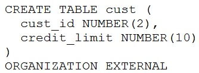

# Question 20
Examine this partial command:

		
Which two clauses are required for this command to execute successfully? (Choose two.)

# Answers
A.the access driver TYPE clause

B.the DEFAULT DIRECTORY clause

C.the REJECT LIMIT clause

D.the LOCATION clause

E.the ACCESS PARAMETERS clause

# Discussions
## Discussion 1
TYPE: "Oracle Database provides two access drivers: ORACLE_LOADER and ORACLE_DATAPUMP. If you omit the TYPE specification, ORACLE_LOADER is the default access driver."
https://docs.oracle.com/cd/B28359_01/server.111/b28310/tables013.htm#ADMIN11705

ACCESS PARAMETERS: "To modify the default behavior of the access driver for external tables, specify access parameters."
https://docs.oracle.com/en/database/oracle/oracle-database/23/sutil/oracle-external-tables-concepts.html#GUID-ACF1D3AA-1D61-4682-AEC5-42C944756E12

REJECT LIMIT : there are several examples that don't use this clause

LOCATION: "For ORACLE_HIVE, the LOCATION clause is not used." 
https://docs.oracle.com/en/database/oracle/oracle-database/23/sutil/oracle-external-tables-concepts.html#GUID-ACF1D3AA-1D61-4682-AEC5-42C944756E12

That about LOCATION confuse me, but I tend to believe it's a very particular case, so the answer should be (BD) DEFAULT DIRECTORY and LOCATION

## Discussion 2
E is also correct since it species the data source of the external tables.

## Discussion 3
A D TRUE BECAUSE IF WE USE LOCATION THEN WE CAN USE DEFAULT DIRECTORY

## Discussion 4
Option A is required because Oracle needs to know how to handle the external data file (driver type).
Option D is required because Oracle needs to know the location of the external data file to access the data.

## Discussion 5
D and E.
B is WRONG, there is no need to define the DEFAULT DIRECTORY, you can specify each of the files with a DIRECTORY, like: 

create directory testsdir as 'c:\tests';

LOGFILE testsdir:'loggile.log'
BADFILE testsdir:'badfile.log'

LOCATION (testsdir:'invoice_data.txt')

Tried to upload the full example but the site does not accept it, gives a Cloudflare error.

