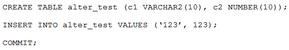

# Question 200
Examine these statements:

		
Which is true about modifying the columns in ALTER_TEST?

# Answers
A.c1 can be changed to NUMBER(10) and c2 can be changed to VARCHAR2(10).

B.c1 can be changed to NUMBER(10) and c2 cannot be changed to VARCHAR2(10).

C.c2 can be changed to NUMBER(5) but c1 cannot be changed to VARCHAR2(5).

D.c1 can be changed to VARCHAR2(10) but c1 cannot be changed to NUMBER(10).

E.c1 can be changed to VARCHAR2(5) but c2 can be changed to NUMBER(12,2).

# Discussions
## Discussion 1
E is right answer.
Column must be empty to change datatype.

## Discussion 2
E is correct

## Discussion 3
E Correct.
create table a_test
(c1 VARCHAR2(10),
c2 NUMBER(10));
insert into a_test values ('123', 123);
select * from a_test;
commit;
alter table a_test modify c1 VARCHAR2(5);
alter table a_test modify c2 NUMBER(12,2);
desc a_test;

if 
alter table a_test modify c1 VARCHAR2(2);
ORA-01441: cannot decrease column length because some value is too big

## Discussion 4
E is correct

## Discussion 5
I think E is correct

