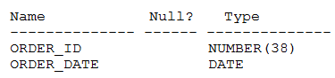
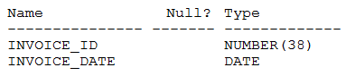

# Question 203
Examine the description of the ORDERS table:

		
Examine the description of the INVOICES table:

		
Which three statements execute successfully? (Choose three.)

# Answers
A.SELECT * FROM orders ORDER BY order_idINTERSECT -SELECT * FROM invoices ORDER BY invoice_id;

B.(SELECT * FROM ordersUNION ALL -SELECT * FROM invoices) ORDER BY order_id;

C.SELECT order_id, order_date FROM ordersUNION ALL -SELECT invoice_id, invoice_date FROM invoices ORDER BY order_id;

D.SELECT * FROM orders -MINUS -SELECT * FROM invoices ORDER BY 1;

E.SELECT order_id invoice_id, order_date FROM ordersMINUS -SELECT invoice_id, invoice_date FROM invoices ORDER BY invoice_id;

F.SELECT * FROM orders ORDER BY order_idUNION -SELECT * FROM invoices;

G.SELECT order_id, order_date FROM ordersINTERSECT -SELECT invoice_id, invoice_date FROM invoices ORDER BY invoice_id;

# Discussions
## Discussion 1
CDE is the correct answer

## Discussion 2
CDE CORRECT. PLEASE HAVE A TRY:

CREATE TABLE ORDERS_01
(
	ORDER_ID NUMBER(38),
	ORDER_DATE DATE
);
CREATE TABLE INVOICES_01
(
	INVOICE_ID NUMBER(38),
	INVOICE_DATE DATE
);

SELECT * FROM ORDERS_01
ORDER BY order_id
INTERSECT
SELECT * FROM INVOICES_01
ORDER BY invoice_id;

SELECT * FROM ORDERS_01
UNION ALL
SELECT * FROM INVOICES_01 ORDER BY ORDER_ID;

SELECT order_id, order_date FROM ORDERS_01
UNION ALL
SELECT invoice_id, invoice_date FROM INVOICES_01 
ORDER BY order_id;

SELECT * FROM ORDERS_01
MINUS
SELECT * FROM INVOICES_01
ORDER BY 1;

SELECT order_id invoice_id, order_date FROM ORDERS_01
MINUS
SELECT invoice_id, invoice_date FROM INVOICES_01
ORDER BY invoice_id;

SELECT * FROM ORDERS_01
ORDER BY order_id
UNION
SELECT * FROM INVOICES_01;

SELECT order_id, order_date FROM ORDERS_01
INTERSECT
SELECT invoice_id, invoice_date FROM INVOICES_01
ORDER BY invoice_id;

## Discussion 3
answer :CDE

## Discussion 4
Tested

## Discussion 5
CDE are correct.
B is wrong as this is subquery without SELECT * in the beginning.

