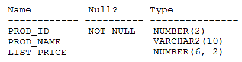

# Question 205
Examine the description of the PRODUCT_INFORMATION table:

		
Which query retrieves the number of products with a null list price?

# Answers
A.SELECT COUNT(NVL(list_price, 0)) FROM product_information WHERE list_price is NULL;

B.SELECT COUNT(list_price) FROM product_information WHERE list_price = NULL;

C.SELECT COUNT(list_price) FROM product_information WHERE list_price IS NULL;

D.SELECT COUNT(DISTINCT list_price) FROM product_information WHERE list_price IS NULL;

# Discussions
## Discussion 1
A is correct

## Discussion 2
A is correct.

## Discussion 3
The answer is A. You need the NVL, otherwise the COUNT won't know what to count. Remember, NULL means unknown.

## Discussion 4
A is correct

## Discussion 5
A is correct

