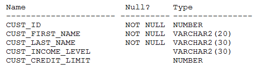

# Question 208
Examine the description of the CUSTOMERS table:

		
For customers whose income level has a value, you want to display the first name and due amount as 5% of their credit limit. Customers whose due amount is null should not be displayed.
Which query should be used?

# Answers
A.SELECT cust_first_name, cust_credit_limit * .05 AS due_amountFROM customers -WHERE cust_income_level IS NOT NULLAND cust_credit_limit IS NOT NULL

B.SELECT cust_first_name, cust_credit_limit * .05 AS due_amountFROM customers -WHERE cust_income_level <> NULL -AND due_amount <> NULL;

C.SELECT cust_first_name, cust_credit_limit * .05 AS due_amountFROM customers -WHERE cust_income_level != NULL -AND cust_credit_level != NULL;

D.SELECT cust_first_name, cust_credit_limit * .05 AS due_amountFROM customers -WHERE cust_income_level != NULL -AND due_amount != NULL;

E.SELECT cust_first_name, cust_credit_limit * .05 AS due_amountFROM customers -WHERE cust_income_level IS NOT NULLAND due_amount IS NOT NULL;

# Discussions
## Discussion 1
A is the correct answer

## Discussion 2
A should be correct

## Discussion 3
A is the correct

## Discussion 4
A is correct

## Discussion 5
A you can't use alias in where clause

