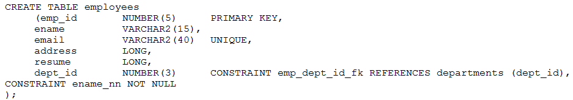

# Question 209
Examine this statement:

		
Which two things must be changed for it to execute successfully? (Choose two.)

# Answers
A.The foreign key constraint on DEPT_ID must be defined at the table level instead of the column level.

B.The NOT NULL constraint on ENAME must be defined at the column level instead of the table level.

C.The primary key constraint on EMP_ID must have a name.

D.One of the LONG columns must be changed to a VARCHAR2 or CLOB.

E.The word CONSTRAINT in the foreign key constraint on DEPT_ID must be changed to FOREIGN KEY.

# Discussions
## Discussion 1
BD is the correct answer.

You can test this :

Create table hr.test_employees
(emp_id number (5) primary key,
Ename varchar2(15) not null,
Email  varchar2(40) unique,
Address long,
Resume clob,
Department_id number(4) constraint emp_dept_id_fx  references hr.departments(department_id)
 );

## Discussion 2
Only one LONG column is allowed per table. refer:
https://docs.oracle.com/cd/A58617_01/server.804/a58241/ch5.htm#418225

## Discussion 3
BD correct answer

## Discussion 4
Must be BD NOT NULL must be declared at column level and only one Long column is allowed

## Discussion 5
BD only one Long per table

