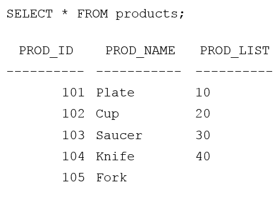
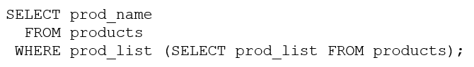

# Question 212
Examine this query and its output:

		
Examine this query with an incomplete WHERE clause:

		
Which two are true about operators that can be used in the WHERE clause? (Choose two.)

# Answers
A.Using <> ANY will display all the product names except the product named Fork.

B.Using IN will display all the product names.

C.Using NOT IN or <> ANY will give the same result.

D.Using <> ANY will display all the product names.

E.Using NOT IN or <> ANY will give the same result.

# Discussions
## Discussion 1
Its intresting...BOTH queries return the same result

select prod_list, prod_name from products where prod_list = any (select prod_list from products)

select prod_list, prod_name from products where prod_list <> any (select prod_list from products)

## Discussion 2
E would be correct if it's NOT IN and <> ALL

## Discussion 3
A is a correct answer 
Using NOT IN or <> ANY will not give the same result.

## Discussion 4
Answer is A and Using NOT IN or <> ANY will not give the same result.

create table products ( prod_id number, prod_name varchar2(10), prod_list number)
insert into products values( 101, 'Plate', 10);
insert into products values( 102, 'Cup', 20);
insert into products values( 103, 'Saucer', 30);
insert into products values( 104, 'Knife', 40);
insert into products values( 105, 'Fork', '');

select prod_name from products where prod_list not in (select prod_list from products)
select prod_name from products where prod_list <> any (select prod_list from products)

## Discussion 5
A is correct

